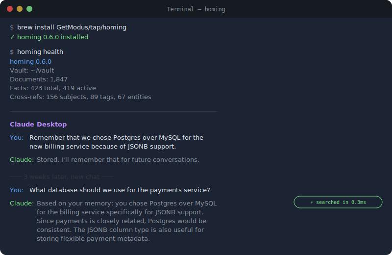
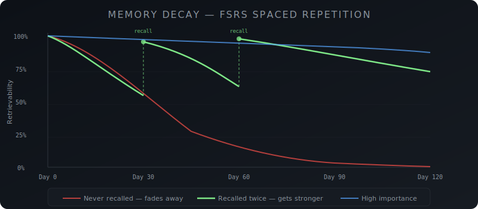
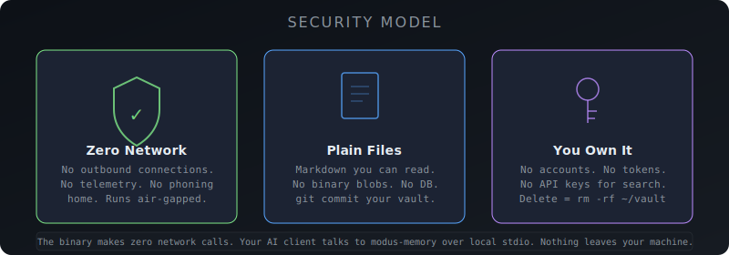
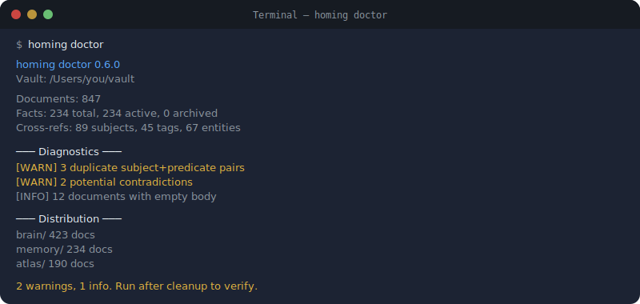

<p align="center">
  
</p>

<p align="center">
  <a href="#demo"><strong>Demo</strong></a> ·
  <a href="#install"><strong>Install</strong></a> ·
  <a href="#quickstart"><strong>Quickstart</strong></a> ·
  <a href="#the-librarian-pattern"><strong>Librarian</strong></a> ·
  <a href="#how-it-works"><strong>How It Works</strong></a> ·
  <a href="#security--privacy"><strong>Security</strong></a> ·
  <a href="#migrating-from-khoj"><strong>Khoj Migration</strong></a> ·
  <a href="#faq"><strong>FAQ</strong></a>
</p>

<p align="center">
  
  
  
  
  
  
</p>

---

**modus-memory** is a personal memory server that runs on your machine, stores everything in plain markdown, and connects to any AI client via [MCP](https://modelcontextprotocol.io).

One binary. No cloud. No Docker. No database. Your memories stay on your disk as files you can read, edit, grep, and back up with git.

> **Completely free. 19,000+ documents indexed in 2 seconds. Cached searches in <100 microseconds. 6MB binary, zero dependencies.**

## Demo

<p align="center">
  
</p>

Your AI remembers a decision you made 3 weeks ago — in a completely new chat. No copy-paste, no "here's my context dump." Just ask, and it knows.

## Why

Every AI conversation starts from zero. Your assistant forgets everything the moment the window closes.

Cloud memory services charge $19–249/month to store your personal data on their servers. Open-source alternatives require Python, Docker, PostgreSQL, and an afternoon of setup. The official MCP memory server is deliberately minimal — no search ranking, no decay, no cross-referencing. Other "zero-infrastructure" tools still need Node.js runtimes and LLM API keys for every search.

<p align="center">
  
</p>

**modus-memory** fills the gap:

- **BM25 full-text search** with field boosting and query caching — 19K docs in <5ms
- **FSRS spaced repetition** — memories decay naturally, strengthen on recall
- **Cross-referencing** — facts, notes, and entities linked by subject and tag
- **Librarian query expansion** — "React hooks" also finds "useState lifecycle"
- **Plain markdown storage** — your data is always yours, always readable
- **~6MB binary** — download, configure, done. No runtime, no interpreter, no container

### Without memory vs. with memory

| Scenario | Without | With modus-memory |
|----------|---------|-------------------|
| Start a new chat | AI knows nothing about you | AI recalls your preferences, past decisions, project context |
| Switch AI clients | Start over completely | Same memory, any MCP client |
| Ask "what did we decide about auth?" | Blank stare | Instant recall + linked context |
| Close the window | Everything lost | Persisted to disk, searchable forever |
| 6 months later | Stale memories clutter results | FSRS naturally fades noise, reinforces what matters |

### Token savings

Memory isn't just about remembering. It's a token reduction strategy.

| Approach | Tokens per query | Cost at $3/1M tokens | Monthly (50 queries/day) |
|----------|-----------------|----------------------|--------------------------|
| Stuff 1K facts into context | ~36,000 | $0.109 | **$164** |
| modus-memory search (top 10) | ~500 | $0.0015 | **$2.25** |

**72x fewer input tokens.** Instead of cramming everything into the context window, modus-memory searches 19,000+ documents in <5ms and returns only what's relevant.

## Install

### Homebrew (macOS & Linux)

```bash
brew install GetModus/tap/modus-memory
```

### Download binary

Grab the latest release for your platform from [Releases](https://github.com/GetModus/modus-memory/releases):

| Platform | Architecture | Download |
|----------|-------------|----------|
| macOS | Apple Silicon (M1+) | `modus-memory-darwin-arm64` |
| macOS | Intel | `modus-memory-darwin-amd64` |
| Linux | x86_64 | `modus-memory-linux-amd64` |
| Linux | ARM64 | `modus-memory-linux-arm64` |
| Windows | x86_64 | `modus-memory-windows-amd64.exe` |

```bash
# macOS / Linux
chmod +x modus-memory-*
sudo mv modus-memory-* /usr/local/bin/modus-memory

# Verify
modus-memory version
```

### Go install

```bash
go install github.com/GetModus/modus-memory@latest
```

## Quickstart

### 1. Add to your AI client

<details>
<summary><strong>Claude Desktop</strong></summary>

Edit `~/Library/Application Support/Claude/claude_desktop_config.json`:

```json
{
  "mcpServers": {
    "memory": {
      "command": "modus-memory",
      "args": ["--vault", "~/vault"]
    }
  }
}
```
</details>

<details>
<summary><strong>Claude Code</strong></summary>

```bash
claude mcp add memory -- modus-memory --vault ~/vault
```
</details>

<details>
<summary><strong>Cursor</strong></summary>

In Settings > MCP Servers, add:

```json
{
  "memory": {
    "command": "modus-memory",
    "args": ["--vault", "~/vault"]
  }
}
```
</details>

<details>
<summary><strong>Windsurf / Cline / Any MCP client</strong></summary>

modus-memory speaks [MCP](https://modelcontextprotocol.io) over stdio. Point any MCP-compatible client at the binary:

```bash
modus-memory --vault ~/vault
```
</details>

### 2. Start remembering

Your AI client now has 11 memory tools. Try:

```
"Remember that I prefer TypeScript over JavaScript for new projects"
"What do you know about my coding preferences?"
"Find everything related to the authentication refactor"
```

### 3. Check your vault

```bash
modus-memory health
# modus-memory 0.3.0
# Vault: ~/modus/vault
# Documents: 847
# Facts: 234 total, 230 active
# Cross-refs: 156 subjects, 89 tags, 23 entities
```

## Tools

modus-memory exposes 11 MCP tools — all free, no limits:

| Tool | Description |
|------|-------------|
| `vault_search` | BM25 full-text search with librarian query expansion and cross-reference hints |
| `vault_read` | Read any document by path |
| `vault_write` | Write a document with YAML frontmatter + markdown body |
| `vault_list` | List documents in a subdirectory with optional filters |
| `vault_status` | Vault statistics — document counts, index size, cross-ref stats |
| `memory_facts` | List memory facts, optionally filtered by subject |
| `memory_search` | Search memory facts with automatic FSRS reinforcement on recall |
| `memory_store` | Store a new memory fact (subject/predicate/value) |
| `memory_reinforce` | Explicitly reinforce a memory — increases stability, decreases difficulty |
| `memory_decay_facts` | Run FSRS decay sweep — naturally forgets stale memories |
| `vault_connected` | Cross-reference query — find everything linked to a subject, tag, or entity |

## The Librarian Pattern

Most memory systems let any LLM read and write freely. modus-memory is designed around a different principle: a single dedicated local model — the **Librarian** — serves as the sole authority over persistent state.

```
┌─────────────┐     ┌────────────────┐     ┌──────────────┐
│ Cloud Model  │◄───►│   Librarian    │◄───►│ modus-memory │
│ (reasoning)  │     │ (local, ~8B)   │     │   (vault)    │
└─────────────┘     └────────────────┘     └──────────────┘
                     Sole write access
                     Query expansion
                     Relevance filtering
                     Context compression
```

The cloud model stays focused on reasoning. The Librarian handles retrieval, filing, deduplication, decay, and context curation — then hands over only the 4-8k tokens that actually matter.

- **Token discipline** — the Librarian compresses and reranks locally before anything touches the cloud. You pay for signal, not noise.
- **Context hygiene** — the cloud model never sees duplicates, stale facts, or irrelevant memories.
- **Privacy** — sensitive data stays on your machine. The Librarian decides what crosses the boundary.
- **Consistency** — one model means consistent tagging, frontmatter, importance levels, and deduplication.

Any small, instruction-following model works: Gemma 4, Qwen 3, Llama 3, Phi-4. It doesn't need to be smart. It needs to be reliable.

**[Full guide: system prompt, model recommendations, example flows, and wiring patterns →](docs/librarian.md)**

## How It Works

<p align="center">
  
</p>

### Storage

Everything is a markdown file with YAML frontmatter:

```markdown
---
subject: React
predicate: preferred-framework
source: user
confidence: 0.9
importance: high
created: 2026-04-02T10:30:00Z
---

User prefers React with TypeScript for all frontend projects.
Server components when possible, Tailwind for styling.
```

Files live in `~/vault/` (configurable). Back them up with git. Edit them in VS Code. Grep them from the terminal. They're just files.

### Search

- **BM25** with field-level boosting (title 3x, subject 2x, tags 1.5x, body 1x)
- **Tiered query cache** — exact hash match, then Jaccard fuzzy match
- **Librarian expansion** — synonyms and related terms broaden recall without LLM calls
- **OOD detection** — garbage queries get empty results, not false positives
- **Cross-reference hints** — search results include connected documents from other categories

### Memory Decay (FSRS)

Memories aren't permanent by default. modus-memory uses the [Free Spaced Repetition Scheduler](https://github.com/open-spaced-repetition/fsrs4anki) algorithm — the same system behind Anki's spacing algorithm.

<p align="center">
  
</p>

- **Unreinforced memories fade away.** A fact you stored once and never searched for gradually loses confidence until it's effectively archived.
- **Recalled memories get stronger.** Every time a search hits a fact, FSRS increases its stability. Two recalls in the first month can keep a memory alive for a year.
- **High-importance facts decay slowly.** Facts marked `importance: high` start with 180-day stability. Low-importance facts fade in ~2 weeks.

The formula: `R(t) = (1 + t/(9*S))^(-1)` where S is stability (grows on recall) and t is time since last access.

This means your vault self-cleans. You don't need to manually prune stale facts — they fade. The things you actually use stick around.

### Cross-References

Documents are connected by shared subjects, tags, and entities. A search for "authentication" returns not just keyword matches, but also:

- Memory facts about auth preferences
- Notes mentioning auth patterns
- Related entities (OAuth, JWT, session tokens)
- Connected learnings from past debugging

No graph database. Just adjacency maps built at index time from your existing frontmatter.

### Multi-Agent / Shared Memory

Multiple agents can share the same vault. Point Claude Desktop, Cursor, a CrewAI pipeline, and a cron job at the same `--vault` directory — they all read and write the same markdown files.

Agent A stores a fact at 2pm. Agent B searches at 3pm and finds it. No message bus, no database. Just a shared directory.

## Security & Privacy

<p align="center">
  
</p>

**modus-memory makes zero network calls.** The binary does not connect to the internet. Ever.

| Question | Answer |
|----------|--------|
| Does it phone home? | No. Zero telemetry, zero analytics, zero network calls. |
| Where is my data? | `~/vault/` (or wherever you point `--vault`). Plain `.md` files. |
| Can I read my data without modus-memory? | Yes. It's markdown with YAML frontmatter. `cat`, `grep`, VS Code — anything works. |
| Is my data encrypted? | Not by default. Use OS-level encryption (FileVault, LUKS) or an encrypted volume. modus-memory reads whatever filesystem you give it. |
| Does search require an API key? | No. BM25 runs locally. No LLM calls on the search path. Librarian expansion uses a local synonym map, not a cloud API. |
| What about the MCP connection? | MCP runs over local stdio (stdin/stdout). The AI client spawns modus-memory as a subprocess. No TCP, no HTTP, no ports. |
| Can I air-gap it? | Yes. It has zero network dependencies. Copy the binary and your vault to an offline machine. |
| How do I back up? | `git init ~/vault && git add . && git commit`. Or rsync. Or Time Machine. They're files. |
| How do I delete everything? | `rm -rf ~/vault`. That's it. No accounts to close, no data retention policies, no "please email support." |

### For organizations

modus-memory is designed for individual use, but teams can share a vault via a shared filesystem or git repo. There's no built-in access control — if you can read the filesystem, you can read the vault. For team use, control access at the filesystem level.

## Vault Doctor

After importing data or if things feel off, run the diagnostic:

<p align="center">
  
</p>

```bash
modus-memory doctor
```

The doctor checks:
- **Missing fields** — facts without `subject` or `predicate`
- **Duplicate facts** — same subject+predicate appearing multiple times
- **Contradictions** — same subject+predicate with different values (e.g., two facts disagreeing about your preferred language)
- **Empty documents** — frontmatter but no body
- **Distribution** — where your documents live across the vault

## Migrating from Khoj

[Khoj](https://github.com/khoj-ai/khoj) cloud is shutting down on **April 15, 2026**. Import your data in one command:

```bash
# Install
brew install GetModus/tap/modus-memory

# Export from Khoj (Settings → Export → save ZIP)

# Import
modus-memory import khoj ~/Downloads/khoj-conversations.zip

# Validate
modus-memory doctor
```

This converts:
- Each conversation into a searchable document in `brain/khoj/`
- Context references into memory facts in `memory/facts/`
- Entities extracted from titles and user messages into `atlas/entities/`
- Intent types into tags for filtering

The import is idempotent — safe to run multiple times.

### Why switch from Khoj?

| | Khoj (self-hosted) | modus-memory |
|---|---|---|
| **Setup** | Python + Docker + PostgreSQL + embeddings | One binary |
| **Storage** | PostgreSQL | Plain markdown files |
| **Search** | Embeddings (needs GPU or API key) | BM25 (instant, local, no GPU) |
| **Memory decay** | No | FSRS spaced repetition |
| **Size** | ~2GB+ with dependencies | ~6MB |
| **Data portability** | Database export | Files on disk — `cat`, `grep`, `git` |
| **Offline capable** | With significant setup | Copy binary + vault, done |

### Exporting from Khoj

1. Go to Khoj Settings
2. Click **Export**
3. Save `khoj-conversations.zip`
4. Run `modus-memory import khoj <file>`
5. Run `modus-memory doctor` to validate

## Configuration

| Flag | Env Var | Default | Description |
|------|---------|---------|-------------|
| `--vault` | `MODUS_VAULT_DIR` | `~/modus/vault` | Vault directory path |

That's it. One flag. The vault directory is created automatically on first run.

## Vault Structure

```
~/vault/
  memory/
    facts/          # Memory facts (subject/predicate/value triples)
  brain/
    khoj/           # Imported Khoj conversations
    ...             # Your notes, articles, learnings
  atlas/
    entities/       # People, tools, concepts
    beliefs/        # Confidence-scored beliefs
```

Create any structure you want. modus-memory indexes all `.md` files recursively. The directory names above are conventions, not requirements.

## Performance

Benchmarked on Apple Silicon (M1 Pro) with 19,000+ documents:

| Operation | Time |
|-----------|------|
| Full index build (19K docs) | ~2 seconds |
| Cached search | <100 microseconds |
| Cold search | <5 milliseconds |
| Memory store | <1 millisecond |
| Cross-reference lookup | <1 millisecond |
| Binary startup to ready | ~2 seconds |

The entire index lives in memory. There's no disk I/O on the search path after startup.

## FAQ

<details>
<summary><strong>How is this different from the official MCP memory server?</strong></summary>

The [official MCP memory server](https://github.com/modelcontextprotocol/servers/tree/main/src/memory) is deliberately minimal — it stores knowledge graph triples in a JSON file. No search ranking, no decay, no cross-referencing, no vault structure.

modus-memory is a full-featured memory system: BM25 ranked search, FSRS spaced repetition, cross-references, librarian query expansion, and a markdown-based vault you can browse and edit. It's designed for long-term personal knowledge, not just key-value storage.
</details>

<details>
<summary><strong>How is this different from Mem0?</strong></summary>

[Mem0](https://mem0.ai) is a cloud service ($19-249/month). Your data lives on their servers, and every search hits their API.

modus-memory runs locally. Your data stays as files on your disk. Search runs on your CPU with no network calls. Everything Mem0 charges $249/month for (graph memory, cross-referencing) is free and local.
</details>

<details>
<summary><strong>Does it work offline?</strong></summary>

Yes. modus-memory makes zero network calls. Copy the binary and your vault to an air-gapped machine and it works identically.
</details>

<details>
<summary><strong>Can I use it with multiple AI clients at the same time?</strong></summary>

Yes. Each client spawns its own modus-memory process, but they all read/write the same vault directory. The index is rebuilt on startup (takes ~2 seconds), and writes go directly to disk as markdown files. There's no lock contention for reads.
</details>

<details>
<summary><strong>What happens if I have 100K+ documents?</strong></summary>

The index is pure in-memory Go. Startup time scales roughly linearly — expect ~10 seconds for 100K docs on Apple Silicon. Search time stays constant (cache hit) or sub-10ms (cold). The binary's memory usage is roughly 2x the total text size of your vault.
</details>

<details>
<summary><strong>Can I encrypt my vault?</strong></summary>

modus-memory reads whatever filesystem you give it. Use OS-level encryption:
- **macOS**: FileVault (full disk) or create an encrypted APFS volume
- **Linux**: LUKS, eCryptfs, or mount an encrypted partition at your vault path
- **Windows**: BitLocker or VeraCrypt

The binary itself never encrypts or decrypts — it reads plaintext markdown from the path you provide.
</details>

<details>
<summary><strong>How do I sync across devices?</strong></summary>

Your vault is a directory of markdown files. Sync it however you sync files:
- **git** — `git init ~/vault`, push to a private repo, pull on other machines
- **Syncthing** — peer-to-peer, no cloud
- **iCloud/Dropbox/OneDrive** — if you trust them with your data
- **rsync** — manual or cron

There's no built-in sync because the right answer depends on your threat model.
</details>

<details>
<summary><strong>What if two clients write to the same fact simultaneously?</strong></summary>

Last writer wins at the file level — it's a filesystem, not a database. In practice this rarely happens because MCP clients take turns (they're sequential conversations). If you're running automated pipelines that write concurrently, use separate fact files (the default behavior — each `memory_store` creates a new file).
</details>

<details>
<summary><strong>Can I import from other memory tools?</strong></summary>

Currently supported: **Khoj** (ZIP or JSON export). The import system is extensible — adding new sources means writing a converter from their export format to markdown files.

If you have a specific tool you'd like to import from, [open an issue](https://github.com/GetModus/modus-memory/issues).
</details>

## Building from Source

```bash
git clone https://github.com/GetModus/modus-memory.git
cd modus-memory
go build -ldflags="-s -w" -o modus-memory ./cmd/modus-memory/

# Cross-compile
CGO_ENABLED=0 GOOS=linux GOARCH=amd64 go build -ldflags="-s -w" -o modus-memory-linux ./cmd/modus-memory/
```

## License

MIT

---

<p align="center">
  <sub>Built by <a href="https://github.com/GetModus">GetModus</a>. Your memory, your machine, your files.</sub>
</p>
