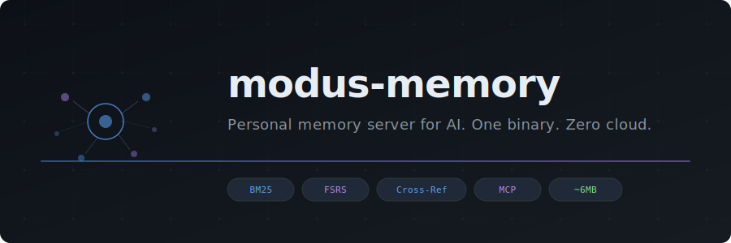
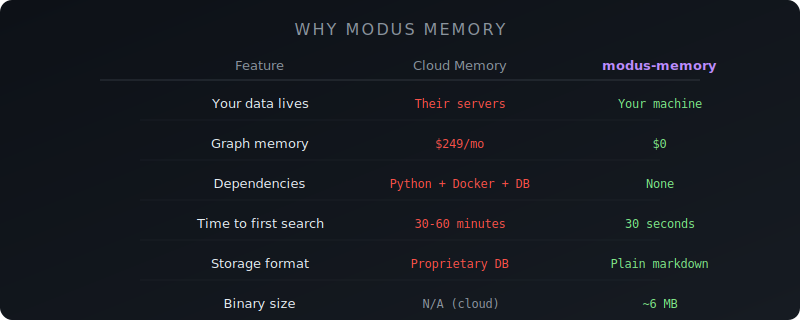
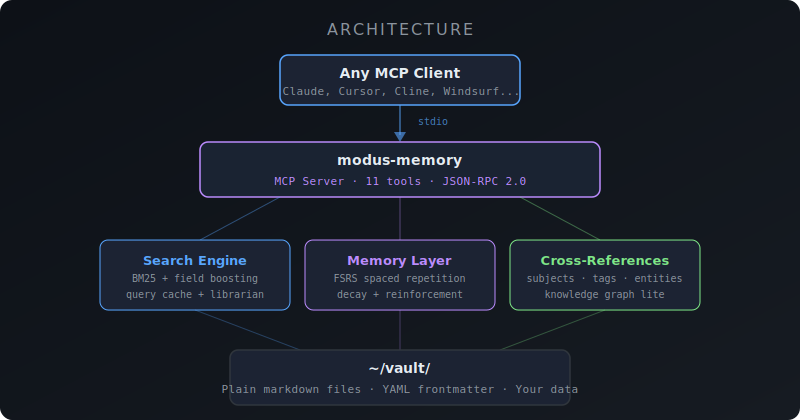

<p align="center">
  
</p>

<p align="center">
  <a href="#install"><strong>Install</strong></a> ·
  <a href="#quickstart"><strong>Quickstart</strong></a> ·
  <a href="#tools"><strong>Tools</strong></a> ·
  <a href="#migrating-from-khoj"><strong>Khoj Migration</strong></a> ·
  <a href="#how-it-works"><strong>How It Works</strong></a>
</p>

<p align="center">
  
  
  
  
  
</p>

---

**modus-memory** is a personal memory server that runs on your machine, stores everything in plain markdown, and connects to any AI client via [MCP](https://modelcontextprotocol.io).

One binary. No cloud. No Docker. No database. Your memories stay on your disk as files you can read, edit, grep, and back up with git.

> **16,000+ documents indexed in 2 seconds. Cached searches in <100 microseconds. 6MB binary, zero dependencies.**

## Why

Every AI conversation starts from zero. Your assistant forgets everything the moment the window closes.

Cloud memory services charge $19–249/month to store your personal data on their servers. Open-source alternatives require Python, Docker, PostgreSQL, and an afternoon of setup. The official MCP memory server is deliberately minimal — no search ranking, no decay, no cross-referencing.

**modus-memory** fills the gap:

- **BM25 full-text search** with field boosting and query caching
- **FSRS spaced repetition** — memories decay naturally, strengthen on recall
- **Cross-referencing** — facts, notes, and entities linked by subject and tag
- **Librarian query expansion** — "React hooks" also finds "useState lifecycle"
- **Plain markdown storage** — your data is always yours, always readable
- **~6MB binary** — download, configure, done

<p align="center">
  
</p>

### Without memory vs. with memory

| Scenario | Without | With modus-memory |
|----------|---------|-------------------|
| Start a new chat | AI knows nothing about you | AI recalls your preferences, past decisions, project context |
| Switch AI clients | Start over completely | Same memory, any MCP client |
| Ask "what did we decide about auth?" | Blank stare | Instant recall + linked context |
| Close the window | Everything lost | Persisted to disk, searchable forever |
| 6 months later | Stale memories clutter results | FSRS naturally fades noise, reinforces what matters |

## Install

### Homebrew (macOS & Linux)

```bash
brew install modusai/tap/modus-memory
```

### Download binary

Grab the latest release for your platform from [Releases](https://github.com/modusai/modus-memory/releases):

| Platform | Architecture | Download |
|----------|-------------|----------|
| macOS | Apple Silicon (M1+) | `modus-memory-darwin-arm64` |
| macOS | Intel | `modus-memory-darwin-amd64` |
| Linux | x86_64 | `modus-memory-linux-amd64` |
| Linux | ARM64 | `modus-memory-linux-arm64` |
| Windows | x86_64 | `modus-memory-windows-amd64.exe` |

```bash
# macOS / Linux
chmod +x modus-memory-*
sudo mv modus-memory-* /usr/local/bin/modus-memory

# Verify
modus-memory version
```

### Go install

```bash
go install github.com/modusai/modus-memory@latest
```

## Quickstart

### 1. Add to your AI client

<details>
<summary><strong>Claude Desktop</strong></summary>

Edit `~/Library/Application Support/Claude/claude_desktop_config.json`:

```json
{
  "mcpServers": {
    "memory": {
      "command": "modus-memory",
      "args": ["--vault", "~/vault"]
    }
  }
}
```
</details>

<details>
<summary><strong>Claude Code</strong></summary>

```bash
claude mcp add memory -- modus-memory --vault ~/vault
```
</details>

<details>
<summary><strong>Cursor</strong></summary>

In Settings > MCP Servers, add:

```json
{
  "memory": {
    "command": "modus-memory",
    "args": ["--vault", "~/vault"]
  }
}
```
</details>

<details>
<summary><strong>Any MCP client</strong></summary>

modus-memory speaks [MCP](https://modelcontextprotocol.io) over stdio. Point any MCP-compatible client at the binary:

```bash
modus-memory --vault ~/vault
```
</details>

### 2. Start remembering

Your AI client now has 11 memory tools. Ask it to:

```
"Remember that I prefer TypeScript over JavaScript for new projects"
"What do you know about my coding preferences?"
"Find everything related to the authentication refactor"
```

### 3. Check health

```bash
modus-memory health

# modus-memory 0.1.0
# Vault: /Users/you/vault
# Documents: 847
# Facts: 234 total, 230 active
# Cross-refs: 156 subjects, 89 tags, 23 entities
```

## Pricing

| | Free | Pro ($10/mo) |
|---|---|---|
| Documents | Up to 1,000 | Unlimited |
| BM25 search | Yes | Yes |
| Read / write / list | Yes | Yes |
| Memory facts | Yes | Yes |
| FSRS decay + reinforcement | — | Yes |
| Cross-referencing | — | Yes |
| Librarian query expansion | Yes | Yes |
| Khoj import | Yes | Yes |
| Priority support | — | Yes |

```bash
# Buy Pro
# → https://modus-memory.lemonsqueezy.com

# Activate
modus-memory activate <license-key>

# Check status
modus-memory status

# Refresh (re-validates with server)
modus-memory refresh
```

Free tier is fully functional for personal use. Pro unlocks the features that matter at scale: memory decay keeps your vault clean, cross-referencing surfaces connections you'd miss, and there's no document ceiling.

## Tools

modus-memory exposes 11 MCP tools (8 free + 3 Pro):

| Tool | Tier | Description |
|------|------|-------------|
| `vault_search` | Free | BM25 full-text search with librarian query expansion and cross-reference hints |
| `vault_read` | Free | Read any document by path |
| `vault_write` | Free | Write a document with YAML frontmatter + markdown body |
| `vault_list` | Free | List documents in a subdirectory with optional filters |
| `vault_status` | Free | Vault statistics — document counts, index size, cross-ref stats |
| `memory_facts` | Free | List memory facts, optionally filtered by subject |
| `memory_search` | Free | Search memory facts with automatic FSRS reinforcement on recall |
| `memory_store` | Free | Store a new memory fact (subject/predicate/value) |
| `memory_reinforce` | **Pro** | Explicitly reinforce a memory — increases stability, decreases difficulty |
| `memory_decay_facts` | **Pro** | Run FSRS decay sweep — naturally forgets stale memories |
| `vault_connected` | **Pro** | Cross-reference query — find everything linked to a subject, tag, or entity |

## How It Works

<p align="center">
  
</p>

### Storage

Everything is a markdown file with YAML frontmatter:

```markdown
---
subject: React
predicate: preferred-framework
source: user
confidence: 0.9
importance: high
created: 2026-04-02T10:30:00Z
---

User prefers React with TypeScript for all frontend projects.
Server components when possible, Tailwind for styling.
```

Files live in `~/vault/` (configurable with `--vault` or `MODUS_VAULT_DIR`). Back them up with git. Edit them in VS Code. Grep them from the terminal. They're just files.

### Search

- **BM25** with field-level boosting (title 3x, subject 2x, tags 1.5x, body 1x)
- **Tiered query cache** — exact hash match, then Jaccard fuzzy match
- **Librarian expansion** — synonyms and related terms broaden recall
- **Cross-reference hints** — search results include connected documents from other categories

### Memory Decay (FSRS)

Memories aren't permanent by default. modus-memory uses the [Free Spaced Repetition Scheduler](https://github.com/open-spaced-repetition/fsrs4anki) algorithm:

```
R(t) = (1 + t/(9*S))^(-1)
```

- **Stability (S)** — how long until a memory fades. Grows each time a memory is recalled.
- **Difficulty (D)** — how hard a memory is to retain. Decreases with successful recall.
- **Retrievability (R)** — current confidence. Decays over time, resets on access.

High-importance facts decay slowly (180-day stability). Low-importance facts fade in 2 weeks. Every search hit automatically reinforces matching facts. Memories that matter survive. Noise fades.

### Cross-References

Documents are connected by shared subjects, tags, and entities. A search for "authentication" returns not just keyword matches, but also:

- Memory facts about auth preferences
- Notes mentioning auth patterns
- Related entities (OAuth, JWT, session tokens)
- Connected learnings from past debugging

No graph database. Just adjacency maps built at index time from your existing frontmatter.

## Migrating from Khoj

[Khoj](https://github.com/khoj-ai/khoj) cloud is shutting down. Import your data in one command:

```bash
# From the Khoj export ZIP
modus-memory import khoj ~/Downloads/khoj-conversations.zip

# Or from raw JSON
modus-memory import khoj conversations.json
```

This converts:
- Each conversation into a searchable document in `brain/khoj/`
- Context references into memory facts in `memory/facts/`
- Intent types into tags for filtering

The import is idempotent — safe to run multiple times.

### Exporting from Khoj

1. Go to Khoj Settings
2. Click **Export**
3. Save `khoj-conversations.zip`
4. Run the import command above

## Configuration

| Flag | Env Var | Default | Description |
|------|---------|---------|-------------|
| `--vault` | `MODUS_VAULT_DIR` | `~/modus/vault` | Vault directory path |

## Vault Structure

```
~/vault/
  memory/
    facts/          # Memory facts (subject/predicate/value)
  brain/
    khoj/           # Imported Khoj conversations
    ...             # Your notes, articles, learnings
  atlas/
    entities/       # People, tools, concepts
    beliefs/        # Confidence-scored beliefs
```

Create any structure you want. modus-memory indexes all `.md` files recursively.

## Performance

Benchmarked on Apple Silicon (M1+) with 16,000+ documents:

| Operation | Time |
|-----------|------|
| Index build | ~2 seconds |
| Cached search | <100 microseconds |
| Cold search | <5 milliseconds |
| Memory start | ~2 seconds |

## Building from Source

```bash
git clone https://github.com/modusai/modus-memory.git
cd modus-memory
go build -ldflags="-s -w" -o modus-memory .

# Cross-compile
CGO_ENABLED=0 GOOS=linux GOARCH=amd64 go build -ldflags="-s -w" -o modus-memory-linux .
```

## License

MIT

---

<p align="center">
  <sub>Built by <a href="https://github.com/modusai">modusai</a>. Your memory, your machine, your files.</sub>
</p>
